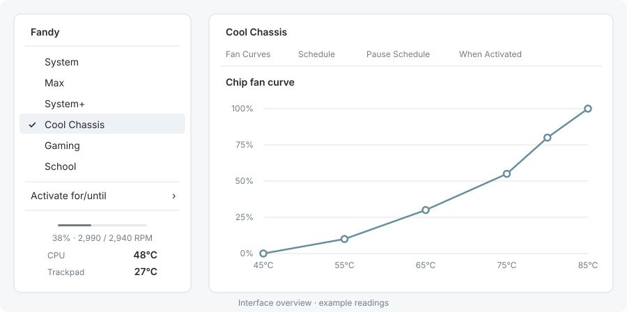

<p align="center">
  
</p>

<h1 align="center">Fandy</h1>
<p align="center">Comfortable typing. Cooler gaming. One-click fan profiles.</p>
<p align="center">
  <a href="https://github.com/NidaleNieve/Fandy_MacOS/releases/latest/download/Fandy-0.2.0-arm64.dmg"><strong>Download for Mac</strong></a>
  · <a href="docs/INSTALLATION.md">Installation help</a>
  · <a href="https://github.com/NidaleNieve/Fandy_MacOS/issues">Report an issue</a>
</p>
<p align="center">Apple Silicon MacBook Pro · macOS 15 or later</p>



Fandy is a small native menu-bar utility for choosing how your Mac cools itself. Pick a profile, set an optional timer, and get back to what you were doing.

## Get started

1. Download the **DMG**, open it, and drag **Fandy** into **Applications**.
2. Open Fandy. Its setup window guides you to enable **Background App Activity** in System Settings.
3. Click the fan icon in the menu bar and choose a profile.

First launch starts in **System**, with macOS controlling the fans. Fandy remembers your everyday profile after setup. Launch at login can be changed in Settings.

> **Current release:** signed with Apple Development and not yet notarized. macOS may block it on another Mac. See [installation help](docs/INSTALLATION.md); no Terminal commands or developer tools are needed to use Fandy.

## Pick your cooling style

| Profile | Best for |
| :--- | :--- |
| **System** | Letting macOS manage the fans. |
| **System+** | Gentle, earlier airflow for everyday use. |
| **Cool Chassis** | Keeping the typing area comfortable, using separate comfort curves and a 0% minimum-airflow setting. |
| **Gaming** | Earlier, stronger cooling during sustained loads. |
| **School** | Quiet work and long typing sessions. |
| **Max** | Running each fan at its reported maximum. |

**Edit Profiles…** lets you adjust the curves, add temperature targets, and create your own presets. System and Max stay protected; the other built-ins can be reset to their defaults. Cooling targets are goals, not guaranteed temperatures. A manual 0% setting means the fan’s reported minimum RPM; macOS may stop fans in System.

## Fit it around your day

- **Temporary cooling:** choose minutes, hours, an end time, or an application to watch. Manual activation still works before that application opens.
- **Schedules:** set different periods for each weekday, including overnight periods and vacation pauses. Manual overrides take priority.
- **At a glance:** choose temperatures and fan-speed readouts inside the menu. Add keyboard shortcuts if you want them.
- **Make it portable:** export individual profiles with their schedules, or move your whole configuration to another Mac.

## Compatibility

Fandy targets **M1–M5 MacBook Pros**, including base, Pro and Max variants. Hardware and sensor checks run before control is enabled; profiles with missing required inputs remain unavailable.

The M5 Pro configuration has been physically tested. Other models are supported using reviewed reference implementations and runtime checks, rather than claimed physical testing. Intel Macs and fanless MacBook Airs are outside the current scope. See the [compatibility matrix](docs/COMPATIBILITY.md).

## Your Mac, your data

Fandy has no accounts, analytics, advertising or automatic uploads. Profiles, schedules and diagnostic logs stay on your Mac. It does not ask for Accessibility, Screen Recording or access to your documents.

Selecting **System** returns control to macOS. Normal Quit releases custom control; a helper watchdog handles missing heartbeats and disconnections. Sensor or control failures trigger automatic restoration. A dead or blocked helper cannot execute its watchdog—see [safety details](SAFETY.md).

[Privacy policy](docs/PRIVACY.md) · [Safety](SAFETY.md) · [Security](SECURITY.md)

## For developers

Native Swift, SwiftUI and AppKit, with local Swift packages and no third-party runtime dependencies. The GUI runs as a normal user. A minimal privileged helper authenticates XPC clients, validates fan limits and maintains temporary control leases; imports cannot grant hardware authority.

Requires Apple Silicon, macOS 15+, and Xcode with Swift 6 support:

```sh
Scripts/test.sh -j 1 --no-parallel
Scripts/build.sh -jobs 1
open build/DerivedData/Build/Products/Debug/Fandy.app
```

Open `Fandy.xcodeproj` and select the shared **Fandy** scheme. Configure your signing team privately as described in [local configuration](docs/LOCAL_CONFIGURATION.md). Unsigned builds can exercise models and UI but cannot authenticate to the production helper. Hardware tests must follow the [hardware gates](docs/HARDWARE_GATES.md).

[Architecture](ARCHITECTURE.md) · [Distribution](docs/DISTRIBUTION.md) · [App Store assessment](docs/APP_STORE_READINESS.md) · [Third-party notices](THIRD_PARTY_NOTICES.md)

Fandy is not currently available on the Mac App Store. Its privileged fan-control architecture has unresolved App Store requirements. The source is available here; required third-party attribution is preserved in the notices. Fandy’s own source does not yet have a separate open-source license.
