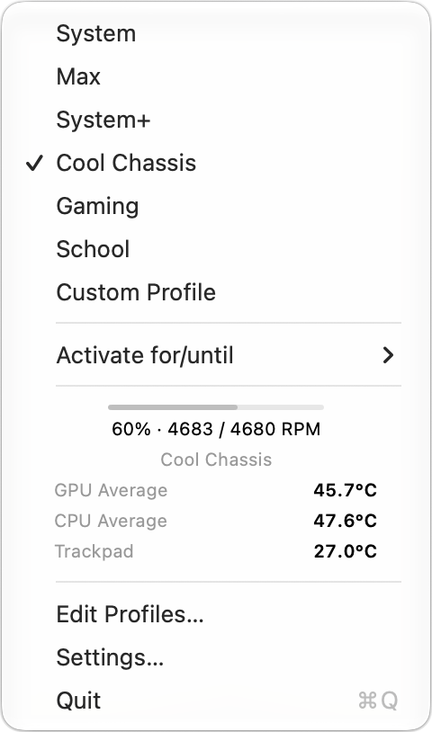
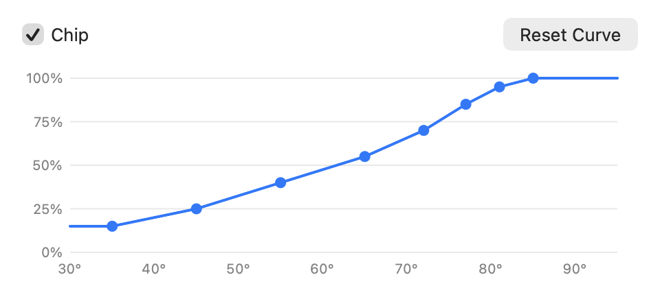

<p align="center">
  
</p>

<h1 align="center">Fandy</h1>
<p align="center">Native Mac fan control with powerful profiles, automation, custom curves, and live temperatures.</p>
<p align="center">
  <a href="https://github.com/NidaleNieve/Fandy_MacOS/releases/latest/download/Fandy-0.2.3-arm64.dmg"><strong>Download for Mac</strong></a>
  · <a href="docs/INSTALLATION.md">Installation help</a>
  · <a href="https://github.com/NidaleNieve/Fandy_MacOS/issues">Report an issue</a>
</p>
<p align="center">Apple Silicon MacBook Pro · macOS 15 or later · Signed &amp; notarized</p>

<p align="center">
  
  &nbsp;
  
</p>

Fandy is a native macOS fan controller and temperature monitor built for Apple Silicon MacBook Pros. Create custom cooling profiles, shape fan curves around chip or chassis temperatures, and automate when profiles activate.

Profiles can follow schedules, react to apps, run temporarily, or stay active for exactly as long as you need. Everything is designed to stay simple to use while giving you much deeper control than a basic fan utility.

Vibecoded with Codex, but very polish.

## Get started

1. Download the **DMG**, open it, and drag **Fandy** into **Applications**.
2. Open Fandy. Its setup window guides you to enable **Background App Activity** in System Settings.
3. Click the fan icon in the menu bar and choose a profile.

## Pick your cooling style

| Profile | Best for |
| :--- | :--- |
| **System** | Letting macOS manage the fans. |
| **System+** | Gentle, earlier airflow for everyday use. |
| **Cool Chassis** | Keeping the typing area comfortable. |
| **Gaming** | Earlier, stronger cooling during sustained loads. |
| **School** | Quiet work and long typing sessions. |
| **Max** | Running each fan at its reported maximum. |
| **Custom Profiles** | Your own cooling curves and temperature targets. |

Create and edit custom profiles with intuitive graphs for chip and chassis temperatures. Drag curve points or set a target temperature in **Edit Profiles…**.

## Fit it around your day

- **Temporary cooling:** activate a profile for minutes or hours, until a time, or until an application closes.
- **Schedules:** choose weekday periods, overnight schedules and vacation pauses.
- **Customizable menu temperatures:** choose the sensor readings shown inside the menu, including CPU/GPU averages and chassis temperatures. Live readings are also available beside the profile editor.
- **At a glance:** show fan speeds and assign keyboard shortcuts.
- **Stay up to date:** automatic updates at your preferred frequency, or check manually in Settings.
- **Make it portable:** export individual profiles with their schedules, or move your whole configuration to another Mac.

## Compatibility

Supports **M1–M5 MacBook Pros** on **macOS 15+**. M5 Pro is physically tested; other models use reference-supported configurations and runtime checks. Intel Macs and fanless MacBook Airs are unsupported. See the [compatibility matrix](docs/COMPATIBILITY.md).

## Your Mac, your data

No accounts, analytics or telemetry. Your configuration stays on your Mac.

**System** returns fan control to macOS. A watchdog and sensor checks protect custom control; see [safety details and limitations](SAFETY.md).

[Privacy policy](docs/PRIVACY.md) · [Safety](SAFETY.md) · [Security](SECURITY.md)

## For developers

Native Swift, SwiftUI and AppKit. The GUI runs as a normal user; a minimal privileged helper authenticates XPC clients, validates fan requests and enforces a watchdog.

Requires Apple Silicon, macOS 15+, and Xcode with Swift 6 support:

```sh
Scripts/test.sh -j 1 --no-parallel
Scripts/build.sh -jobs 1
open build/DerivedData/Build/Products/Debug/Fandy.app
```

Open `Fandy.xcodeproj` with the **Fandy** scheme. Set up [local signing](docs/LOCAL_CONFIGURATION.md) before using the helper. Follow the [hardware gates](docs/HARDWARE_GATES.md) for physical tests.

[Architecture](ARCHITECTURE.md) · [Distribution](docs/DISTRIBUTION.md) · [App Store assessment](docs/APP_STORE_READINESS.md) · [Third-party notices](THIRD_PARTY_NOTICES.md)

Released under the [MIT license](LICENSE). Third-party notices retain their original licenses.

Not currently available on the Mac App Store.
